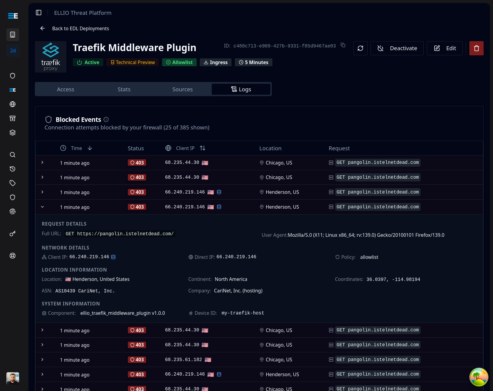

<div align="center">


# ELLIO Traefik Middleware Plugin

**Dynamic IP-based access control for Traefik using ELLIO External Dynamic Lists (EDL)**

[](https://github.com/ELLIO-Technology/ELLIO-Traefik-Middleware-Plugin)
[](https://go.dev)
[](https://github.com/ELLIO-Technology/ELLIO-Traefik-Middleware-Plugin/actions)
[](https://github.com/ELLIO-Technology/ELLIO-Traefik-Middleware-Plugin/releases)
[](LICENSE)

[Documentation](https://docs.ellio.tech) • [ELLIO Platform](https://platform.ellio.tech) • [Report Issue](https://github.com/ELLIO-Technology/ELLIO-Traefik-Middleware-Plugin/issues)

</div>

---

## Overview

The ELLIO Traefik Middleware Plugin provides IP-based access control for services behind Traefik proxy. It integrates with the ELLIO platform to dynamically manage IP allowlists and blocklists through External Dynamic Lists (EDL), ensuring your services are protected against promiscious scanners and mass exploitation attempts.

## Prerequisites

- Traefik v3.0 or later
- ELLIO Platform account
- An External Dynamic List (EDL) configured for Traefik Middleware in the ELLIO platform
- Bootstrap token from your EDL configuration

## Quick Start

### 1. Create an EDL in ELLIO Platform

Log into the [ELLIO Platform](https://platform.ellio.tech) and create a new External Dynamic List (EDL) with type "Traefik Middleware". This will generate a bootstrap token specific to your EDL configuration.

### 2. Configure Traefik Plugin

Add the plugin to your Traefik static configuration:

```yaml
# traefik.yml
experimental:
  plugins:
    ellio:
      moduleName: github.com/ELLIO-Technology/ELLIO-Traefik-Middleware-Plugin
      version: v1.0.0
```

### 3. Configure Middleware

Create a middleware instance in your dynamic configuration:

```yaml
# dynamic-config.yml
http:
  middlewares:
    ellio-edl:
      plugin:
        ellio:
          bootstrapToken: "${ELLIO_BOOTSTRAP}"  # Your EDL bootstrap token
          logLevel: "info"
          ipStrategy: "xff"  # or "direct", "real-ip", "custom"
```

### 4. Apply to Routes

Apply the middleware to your routes:

```yaml
http:
  routers:
    my-service:
      rule: Host(`api.example.com`)
      middlewares:
        - ellio-edl
      service: my-backend
```

### 5. Deploy

Set your EDL bootstrap token and start Traefik:

```bash
export ELLIO_BOOTSTRAP="your-edl-bootstrap-token"
docker compose up -d
```

## Configuration

### Basic Configuration

| Parameter | Type | Required | Default | Description |
|-----------|------|----------|---------|-------------|
| `bootstrapToken` | string | Yes | - | EDL bootstrap token from ELLIO platform |
| `logLevel` | string | No | `"info"` | Logging verbosity: trace, debug, info, warn, error |
| `ipStrategy` | string | No | `"direct"` | IP extraction strategy (see below) |
| `trustedHeader` | string | No | - | Custom header for IP extraction (when using "custom" strategy) |
| `trustedProxies` | []string | No | - | List of trusted proxy IPs or CIDR ranges |

### IP Extraction Strategies

The plugin supports multiple strategies for extracting client IP addresses:

- **direct** - Use the direct connection IP address
- **xff** - Extract from X-Forwarded-For header (for reverse proxies)
- **real-ip** - Extract from X-Real-IP header
- **custom** - Extract from a custom header specified in `trustedHeader`

### Trusted Proxies Configuration

When using header-based IP extraction, configure trusted proxies to prevent IP spoofing:

```yaml
http:
  middlewares:
    ellio-edl:
      plugin:
        ellio:
          bootstrapToken: "${ELLIO_BOOTSTRAP}"
          ipStrategy: "xff"
          trustedProxies:
            - "10.0.0.0/8"
            - "172.16.0.0/12"
            - "192.168.0.0/16"
            - "loopback"  # 127.0.0.0/8 and ::1
            - "private"   # All RFC1918 ranges
```

## How It Works

1. **EDL Configuration** - Configure an External Dynamic List in the ELLIO platform with your IP rules
2. **Bootstrap** - Plugin authenticates using the EDL bootstrap token
3. **IP List Sync** - Plugin fetches and caches the IP list from your EDL
4. **Request Processing** - Each incoming request is checked against the cached IP list
5. **Dynamic Updates** - IP lists are automatically refreshed based on EDL configuration
6. **Access Control** - Requests are allowed or blocked based on EDL mode (blocklist/allowlist)

## Platform Integration

<div align="center">
  
</div>

The plugin integrates seamlessly with the ELLIO platform:

- **Centralized Management** - Manage all IP lists from the ELLIO platform
- **Real-time Updates** - Changes to EDL are automatically propagated
- **Event Logging** - Only blocked events are logged to the platform for your monitoring

## Architecture

The plugin uses a singleton architecture to optimize resource usage across multiple middleware instances:

```
┌─────────────────────────────────────────┐
│         Traefik Instance                │
├─────────────────────────────────────────┤
│  ┌───────────────────────────────────┐  │
│  │    Middleware Instances           │  │
│  │  ┌──────┐ ┌──────┐ ┌──────┐       │  │
│  │  │ MW-1 │ │ MW-2 │ │ MW-3 │       │  │
│  │  └───┬──┘ └───┬──┘ └───┬──┘       │  │
│  │      └────────┼────────┘          │  │
│  │               ▼                   │  │
│  │     ┌──────────────────┐          │  │
│  │     │ Singleton Manager│          │  │
│  │     │   - JWT Token    │          │  │
│  │     │   - EDL Cache    │          │  │
│  │     │   - IP Trie      │          │  │
│  │     └──────────────────┘          │  │
│  └───────────────────────────────────┘  │
└─────────────────────────────────────────┘
```

### Key Features

- **Single Token Management** - One JWT token shared across all instances
- **Efficient IP Matching** - Trie-based structure for O(32) IPv4 lookups
- **Atomic Updates** - Thread-safe EDL updates without service interruption
- **Background Refresh** - Automatic token and EDL refresh

## Installation

### Production Setup

For production deployments, use the Traefik plugin catalog:

```yaml
experimental:
  plugins:
    ellio:
      moduleName: github.com/ELLIO-Technology/ELLIO-Traefik-Middleware-Plugin
      version: v1.0.0
```

### Complete Examples

Ready-to-run examples are available in the `examples/` directory:

- **[examples/basic/](examples/basic/)** - Production setup with plugin catalog
- **[examples/local-plugin/](examples/local-plugin/)** - Local development setup

Each example includes:
- Complete `docker-compose.yml`
- Traefik static and dynamic configuration
- Environment variables template
- Step-by-step instructions

Quick start:
```bash
cd examples/basic
cp .env.example .env
# Add your EDL bootstrap token to .env
docker compose up
```

## Advanced Configuration Examples

### Behind CloudFlare

```yaml
http:
  middlewares:
    ellio-cloudflare:
      plugin:
        ellio:
          bootstrapToken: "${ELLIO_BOOTSTRAP}"
          ipStrategy: "custom"
          trustedHeader: "CF-Connecting-IP"
          trustedProxies:
            - "173.245.48.0/20"
            - "103.21.244.0/22"
            - "103.22.200.0/22"
            # Add all CloudFlare IP ranges
```

### Multi-tier Proxy Setup

```yaml
http:
  middlewares:
    ellio-multitier:
      plugin:
        ellio:
          bootstrapToken: "${ELLIO_BOOTSTRAP}"
          ipStrategy: "xff"
          trustedProxies:
            - "private"  # Trust all private networks
          logLevel: "debug"  # For troubleshooting
```

## Graceful Degradation

The plugin handles various failure scenarios gracefully:

- **EDL Deleted** - If the EDL is deleted (410 response), the plugin switches to allow-all mode
- **EDL Disabled** - If the EDL is deleted (404 response), the plugin switches to allow-all mode
- **Network Failures** - Cached IP lists continue to be used during network outages


## Development

For development setup, testing, and contribution guidelines, see [DEVELOPMENT.md](DEVELOPMENT.md).

## Support

- **Documentation**: [https://docs.ellio.tech](https://docs.ellio.tech)
- **Issues**: [GitHub Issues](https://github.com/ELLIO-Technology/ELLIO-Traefik-Middleware-Plugin/issues)
- **ELLIO Platform**: [ELLIO Platform](https://platform.ellio.tech)

## License

Copyright © 2025 ELLIO Technology s.r.o.

Licensed under the Apache License, Version 2.0. See [LICENSE](LICENSE) for details.

## Trademarks

- ELLIO is a registered trademark of ELLIO Technology s.r.o.
- Traefik® is a registered trademark of Traefik Labs
- All other trademarks are property of their respective owners.

---

<div align="center">
  Part of the <a href="https://platform.ellio.tech">ELLIO EDL Management Platform</a>
  <br>
  Copyright © ELLIO Technology s.r.o.
</div>
